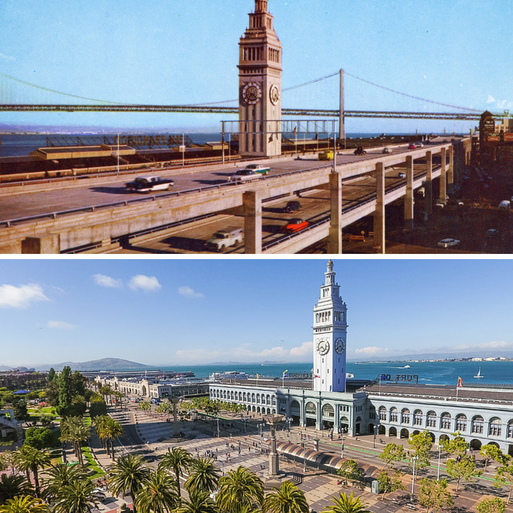
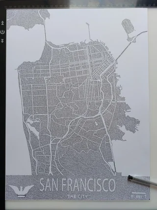
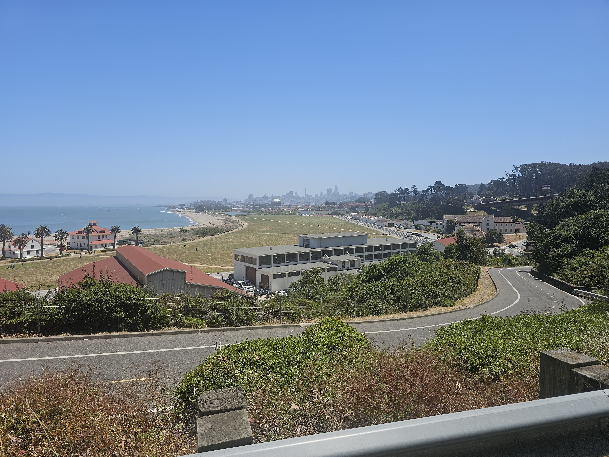
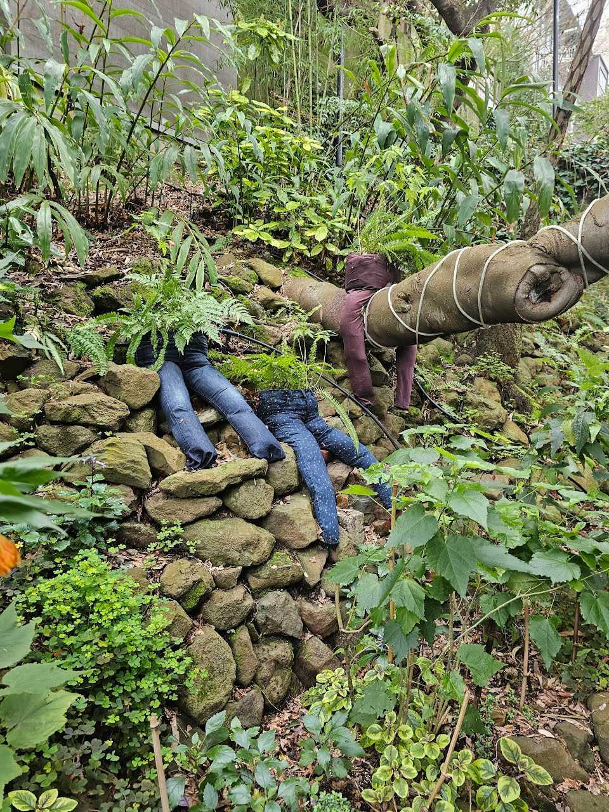
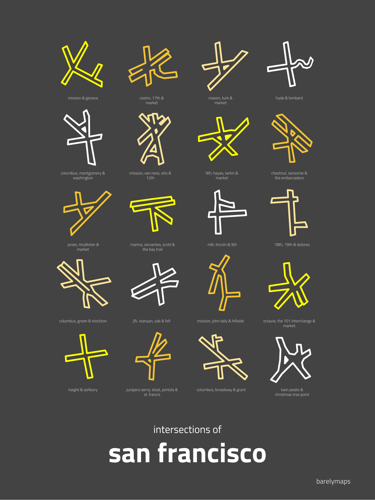

+++
title = "San Francisco"
date = 2025-05-16T00:37:24-07:00
tags = ["Collections"]
+++

San Francisco Things

<!--more-->

# Links

## Food

- [Honest Prices](https://sfhonestprices.org/)
- [See Fees](https://www.seefees.ca/)

## History & Trivia

- [San Francisco City Guides](https://sfcityguides.org/)
- [Street Names Quiz](https://carvin.github.io/sf-street-names/)
- [Find Waldo — The Photo Game](https://waldo.tanay.app/)
- [Where the Streetcars Used to go](https://sfstreetcars.co/)
- [MUNI Routle — Guess the Muni Route](https://www.muniroutle.com/)
- [SF Streets History](http://sfstreets.noahveltman.com/)
- [SF Street Tree Map](https://bsm.sfdpw.org/urbanforestry/)
- [SF Hills](http://hillmapper.com/)
- [Map of Buried Ships](https://medium.com/@UpOutSF/this-map-shows-where-all-the-ships-are-buried-underneath-san-francisco-1e44788859e3)
- [The 1906 San Francisco Earthquake Map](https://earthobservatory.nasa.gov/blogs/elegantfigures/2011/05/10/one-of-my-favorite-maps-the-1906-san-francisco-earthquake/)
- [SF Transit Interactive Story](https://sftransit.fun/)
- [Find My Parking Cops](https://walzr.com/sf-parking/)
- [911 call stream](https://walzr.com/sf-911)
- [Sealions Webcam](https://www.pier39.com/sealions/)
- [Hiking By Transit — San Francisco](https://hikingbytransit.com/san-francisco/)

## Government & Policy

- [SF Streets Blog](https://sf.streetsblog.org)
- [SF MTA Bus Rules](https://www.sfmta.com/sites/default/files/reports-and-documents/2017/12/bus_rules_and_instructions_handbook.pdf)
- [Gov Graph](https://sfgov.civlab.org/)
- [Seamless Bay Area](https://www.seamlessbayarea.org/)
- [SF Transit Riders](https://sftransitriders.org/)
- [SF Transparency / Political Accountability Tracker](https://transparencysf.askbobo.com/)
- [San Francisco Planning Department GIS Tools](https://sfplanninggis.org/intro/)

## Volunteering

- [NERT](https://sf-fire.org/nert)
- [ACS](https://www.sf.gov/information--auxiliary-communications-service)
- [ALERT](https://www.sanfranciscopolice.org/community/programs/auxilary-law-enforcement-response-team-alert-program)
- [Refuse Refuse](https://refuserefusesf.org/)

## Famous Characters

### Bummer and Lazarus

- [Bummer and Lazarus - Wikipedia](https://en.wikipedia.org/wiki/Bummer_and_Lazarus)

### Emperor Norton

- [Emperor Norton - Wikipedia](https://en.wikipedia.org/wiki/Emperor_Norton)
- [The Emperor Norton Trust](https://emperornortontrust.org/)

### Frederick_Coombs

- [Frederick_Coombs - Wikipedia](https://en.wikipedia.org/wiki/Frederick_Coombs)

### Frank Chu

- [Frank Chu - Wikipedia](https://en.wikipedia.org/wiki/Frank_Chu)

# Additional Sources

1. Meck, S., & Retzlaff, R. (2018). The emergence of comprehensive urban design planning in the United States: The case of the San Francisco Urban Design Plan. Journal of Urban Design, 23(1), 94–122. https://doi.org/10.1080/13574809.2017.1361787
1. Chloe Veltman (Prod.). (2019, January 24). Is There a San Francisco Accent? [Mp3]. In Bay Curious. KQED. https://od1.kqed.org/anon.kqed/radio/new-bay-curious/2019/01/SFAccent.mp3

# California Wide

1. [CalBike — California Bicycle Coalition](https://www.calbike.org/)

# Images

## The Ferry Building 60 Years Apart

## San Francisco in One Line

## A Nice View of Layers of SF

## Plants In Pants In Plants

## Intersections of San Francisco

